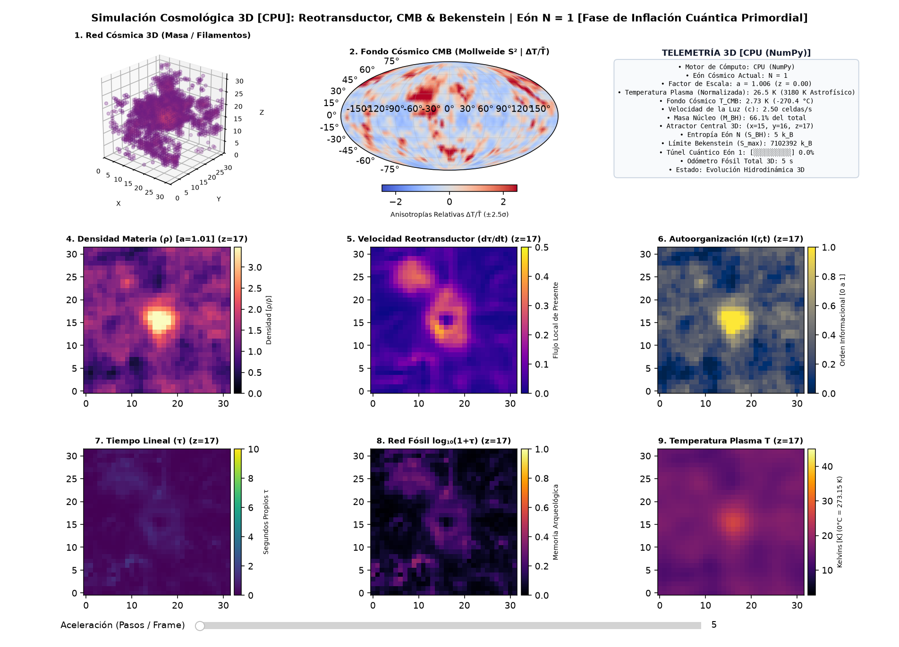
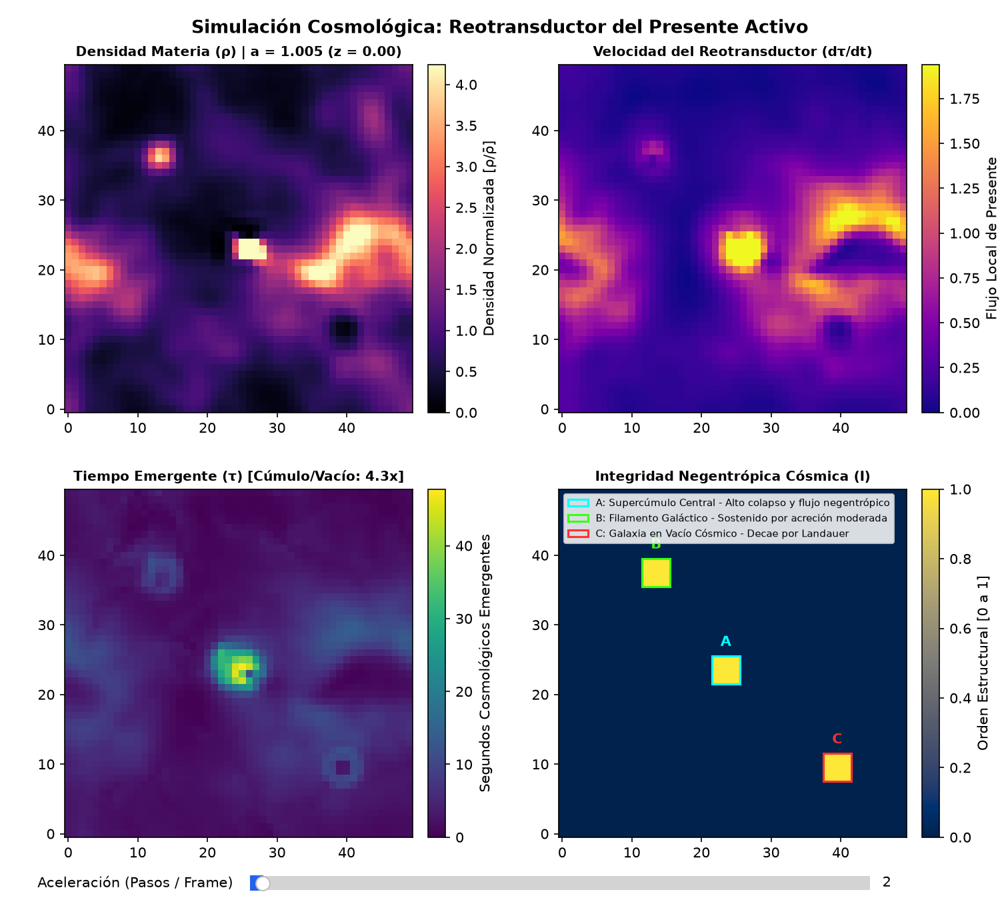
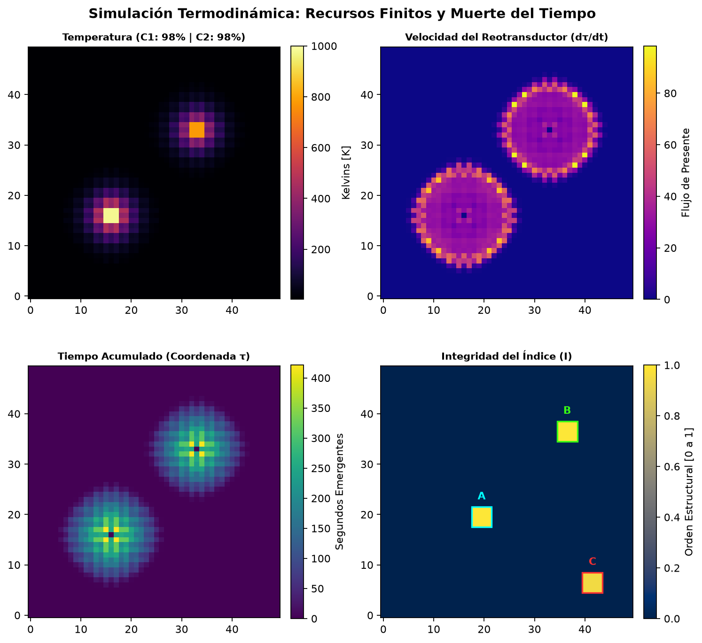

# Rheotransductor (Reotransductor)

[](https://www.python.org/downloads/)
[](LICENSE)
[](https://numpy.org/)
[](https://matplotlib.org/)

A suite of physical and numerical simulations exploring the **Active Present Rheotransducer** (*Reotransductor del Presente Activo*) — modeling the emergence of local **thermal time** ($\tau$) driven by Onsager entropy production, non-equilibrium dissipative heat flows, finite energy reservoirs, and Landauer's informational limit.

---

## Available Simulations

| Simulation | File | Description |
|---|---|---|
| **Core Rheotransducer** | [`simulador_reotransductor.py`](simulador_reotransductor.py) | Fundamental non-equilibrium thermodynamic simulation with finite boilers, Landauer negentropy decay, and Onsager dissipation. |
| **Cosmological Rheotransducer 2D** | [`simulador_cosmologico.py`](simulador_cosmologico.py) | 2D cosmological model with cellular time emergence, Bekenstein entropy saturation, White Hole bounce, and fossil memory. |
| **Cosmological Rheotransducer 3D (CPU)** | [`simulador_cosmologico_3d.py`](simulador_cosmologico_3d.py) | 3D cosmological model featuring 3D Poisson gravity ($1/r^2$), Zel'dovich cosmic web, real-time Mollweide CMB sky projection, and 3D Bekenstein holography (pure NumPy). |
| **Cosmological Rheotransducer 3D (GPU)** | [`simulador_cosmologico_3d_gpu.py`](simulador_cosmologico_3d_gpu.py) | Hardware-accelerated 3D cosmological model running in VRAM on NVIDIA CUDA (CuPy) with in-place rendering for hyper-drive simulation speed. |

---

## Simulation Dashboards

### 1. 3D Cosmological Model & CMB Sky Projection (Mollweide)


### 2. 2D Cosmological Rheotransducer Dashboard


### 3. Core Thermodynamic Dashboard


---

## Theoretical Framework & Mathematical Formulation

For the complete, rigorous mathematical derivations, differential equations, and code implementation mapping, see the dedicated document:
👉 **[Comprehensive Theory and Mathematical Formulation](docs/THEORY_AND_MATHEMATICAL_FORMULATION.md)**

The project integrates non-equilibrium thermodynamics, gravitational collapse, and information theory across spatial continua:

### 1. Thermal Diffusion & Fluid Dynamics
* **Thermal Conduction**: Heat flows according to Fourier's equation:
  $$\frac{\partial T}{\partial t} = k \, \nabla^2 T$$
* **Cosmological Matter Advection**: In the cosmological model, matter infall is driven by the gravitational potential $\Phi$ solved exactly via 2D Fast Fourier Transform ($\nabla^2 \Phi = 4\pi G (\rho - \bar{\rho})$):
  $$\mathbf{v} = -\mu \nabla \Phi, \quad \frac{\partial \rho}{\partial t} = -\nabla \cdot (\rho \mathbf{v}) + D_\rho \nabla^2 \rho$$

### 2. Onsager Dissipation & Entropy Production
The thermodynamic driving forces are the inverse temperature gradient and gravitational flux:
$$\mathbf{X}_T = \nabla\left(\frac{1}{T}\right), \quad \sigma = \mathbf{J}_T \cdot \nabla\left(\frac{1}{T}\right) + \frac{\rho \|\nabla \Phi\|^2}{T} \ge 0$$
where $\mathbf{J}_T = -k \nabla T$ is the heat flux.

### 3. The Rheotransducer: Emergent Cellular Proper Time ($\tau$)
Classical cosmology (e.g., Friedman-Lemaître-Robertson-Walker metrics) relies on an idealized, global cosmic clock. In reality, **proper time is local and emergent**:
$$\frac{d\tau_i}{dt} = \kappa \cdot \sigma_i(x, y)$$
* **Collapsing Clusters & Superclusters**: High matter accretion and thermal dissipation produce high entropy production $\sigma \implies$ time ticks vigorously ($d\tau/dt \gg 0$).
* **Cosmic Voids**: In near-uniform underdense voids ($\nabla T \to 0, \nabla \Phi \to 0$), $\sigma \to 0 \implies$ **local time practically freezes**.

### 4. Dynamic Informational Field & Landauer's Limit ($I$)
Low-entropy structures (coherent states, complex matter, biological systems) require continuous negentropic consumption to counteract thermal noise and Landauer decay:
* **Core Thermodynamic Model**: Models discrete bounded index islands ($I_A, I_B, I_C$) fed by local thermal flux $\mathbf{J}_T$.
* **Cosmological Model (Continuous Field $I(\mathbf{r}, t)$)**: In accordance with Schrödinger, Prigogine, and Landauer, order is represented as a **continuous dynamic scalar field** that advects with matter velocity $\mathbf{v}$ and self-organizes in dissipative filamentary nodes:
  $$\frac{\partial I}{\partial t} + \nabla \cdot (I \mathbf{v}) = D_I \nabla^2 I + \alpha \sigma \left(\frac{\rho}{\bar{\rho}}\right) - \beta T - \gamma_{\text{Landauer}} I$$
  When galaxies and filaments merge, the informational field naturally coalesces into unified negentropic superclusters, while expanding cosmic voids smoothly decay toward informational erasure ($I \to 0$).

### 5. Bekenstein Informational Capacity & Black Hole -> White Hole Transition
In standard general relativity, gravitational collapse leads to non-physical mathematical singularities ($\rho \to \infty$). Grounded in **Loop Quantum Gravity (LQG/LQC)** (Ashtekar, Rovelli, Vidotto, Christodoulou), a collapsed black hole saturates when its accumulated internal informational entropy exceeds the **Bekenstein-Hawking bound**:
$$S_{\text{max}} = \frac{k_B c^3 A}{4 G \hbar} \propto M_{\text{BH}}^2$$
* **Quantum Tunneling into a White Hole**: When $S_{\text{BH}}(t) \ge S_{\text{max}}$, the black hole undergoes a quantum tunnel transition into a **White Hole**, expelling its compressed matter outward in an explosive blast wave (the **Big Bounce** into Eon $N+1$).
* **Cosmic Inflation & Causal Speed Limit ($c$)**: Each new eon initiates with a brief **quantum inflationary super-expansion** ($a < 1.05$) that homogeneously stretches primordial perturbation modes across cosmological scales. Following inflation, matter advection strictly obeys the relativistic speed limit ($\|\mathbf{v}\| \le c = 2.5\text{ cells/s}$).
* **Fossil Time Coupling & Multi-Eon Archaeology**: While the scale factor $a$ and temperature $T$ undergo quantum reheating, the **Rheotransducer proper time field $\tau(x, y)$ is monotonically preserved**. The logarithmic archaeological panel $\log_{10}(1 + \tau)$ maps the multi-eon cosmic web, showing how past universal lifetimes continuously seed future structure formation.

---

## Quick Start

### Prerequisites
* **Python 3.10+**
* `pip` or [`uv`](https://github.com/astral-sh/uv)

### 1. Clone the repository
```bash
git clone https://github.com/jzsalinas/reotransductor.git
cd reotransductor
```

### 2. Set up virtual environment & install dependencies

Using standard `venv` and `pip`:
```bash
python3 -m venv .venv
source .venv/bin/activate
pip install -r requirements.txt
```

Or using `uv` (fast):
```bash
uv venv .venv
source .venv/bin/activate
uv pip install -r requirements.txt
```

### 3. Run the simulations

**To run the 3D Cosmological Model on GPU (NVIDIA CUDA / CuPy - Ultra-Fast):**
```bash
python simulador_cosmologico_3d_gpu.py
```

**To run the 3D Cosmological Model on CPU (pure NumPy):**
```bash
python simulador_cosmologico_3d.py
```

**To run the 2D Cosmological Model:**
```bash
python simulador_cosmologico.py
```

**To run the Core Thermodynamic Simulation:**
```bash
python simulador_reotransductor.py
```

---

## Interactive Controls

* **Acceleration Slider**: Dynamically adjust execution from **1x** up to **1000x** physics steps per frame.
* **Matplotlib Navigation Toolbar**: Pan, zoom, and export vector or raster snapshots.

---

## Repository Structure

```
reotransductor/
├── assets/
│   ├── preview.png                 # Core simulation snapshot
│   ├── preview_cosmology.png       # 2D Cosmological simulation snapshot
│   └── preview_cosmology_3d.png    # 3D Cosmological simulation snapshot
├── .gitignore                      # Python & virtual environment ignore rules
├── LICENSE                         # MIT License
├── pyproject.toml                  # Project metadata & packaging configuration
├── requirements.txt                # Production dependencies
├── README.md                       # Documentation & mathematical foundations
├── simulador_cosmologico.py        # 2D Cosmological model with cellular time emergence
├── simulador_cosmologico_3d.py     # 3D Cosmological model (CPU / NumPy)
├── simulador_cosmologico_3d_gpu.py # 3D Cosmological model (GPU / CUDA CuPy)
└── simulador_reotransductor.py      # Core thermodynamic Rheotransducer simulation
```

---

## License

This project is licensed under the **MIT License** - see the [LICENSE](LICENSE) file for details.

## Author

* **José Salinas** ([@jzsalinas](https://github.com/jzsalinas)) - *Initial concept, thermodynamics formulation & simulation engine.*
