# Mathematical Genealogy and Theoretical Lineage

This document establishes the historical and mathematical lineage of every foundational equation, theorem, and algorithm implemented in the **Reotransductor** cosmological framework. 

Just as mathematicians trace their academic lineage through advisor-student trees back to Gauss, Euler, and Archimedes, the physical equations governing this framework trace their mathematical heritage through classical mechanics, non-equilibrium thermodynamics, quantum gravitation, and spectral harmonic analysis.

---

## 1. Overview: The Five Pillars of Theoretical Lineage

```mermaid
flowchart TD
    subgraph Pillar1 ["Pillar I: Thermodynamic Time Emergence"]
        C1["Archimedes (250 BC)<br>Equilibrium & Statics"] --> C2["Carnot & Clausius (1824-1850)<br>dS >= dQ/T"]
        C2 --> C3["Boltzmann (1877)<br>S = k_B ln W"]
        C3 --> C4["Onsager (1931)<br>sigma = sum J_i X_i"]
        C4 --> C5["Prigogine (1955)<br>Dissipative Structures"]
        C5 --> C6["Landauer (1961)<br>Delta E = k_B T ln 2"]
        C6 --> C7["Reotransductor (2026)<br>dtau/dt = 1 + kappa_0 sigma"]
    end

    subgraph Pillar2 ["Pillar II: Gravitation & Poisson Mesh"]
        G1["Newton (1687)<br>F = G M m / r^2"] --> G2["Laplace & Poisson (1813)<br>Nabla^2 Phi = 4 pi G rho"]
        G2 --> G3["Fourier (1822)<br>Harmonic Decomposition"]
        G3 --> G4["Jeans (1902)<br>lambda_J = c_s sqrt(pi / G rho)"]
        G4 --> G5["Cooley & Tukey (1965)<br>Fast Fourier Transform (FFT)"]
        G5 --> G6["Reotransductor (2026)<br>Torus T^3 FFT Gravity Solver"]
    end

    subgraph Pillar3 ["Pillar III: Plasma Kinetics & Sound Speed"]
        H1["Euler & Navier-Stokes (1757-1845)<br>Fluid Transport"] --> H2["Laplace (1816)<br>c_s^2 = gamma P / rho"]
        H2 --> H3["Coulomb (1785)<br>Electrostatic Collisions"]
        H3 --> H4["Spitzer & Braginskii (1953-1962)<br>kappa_Spitzer ~ T^(5/2) / rho"]
        H4 --> H5["Reotransductor (2026)<br>Relativistic Sound & Conduction Field"]
    end

    subgraph Pillar4 ["Pillar IV: Quantum Horizon & Conformal Bounce"]
        Q1["Einstein (1915)<br>G_munu = 8 pi G T_munu"] --> Q2["Schwarzschild (1916)<br>r_s = 2GM / c^2"]
        Q2 --> Q3["Bekenstein & Hawking (1973-1974)<br>S_BH = (k_B c^3 / 4 G hbar) A"]
        Q3 --> Q4["Penrose (2010)<br>Conformal Cyclic Cosmology"]
        Q4 --> Q5["Rovelli & Vidotto (2014)<br>Planck Stars & White Hole Bounce"]
        Q5 --> Q6["Reotransductor (2026)<br>Holographic Phase-Locking"]
    end

    subgraph Pillar5 ["Pillar V: Observational Spectral Analysis"]
        S1["Legendre (1782)<br>Legendre Polynomials P_ell(x)"] --> S2["Laplace & Rodrigues (1785-1816)<br>Spherical Harmonics Y_lm"]
        S2 --> S3["Rayleigh & Parseval (1877-1899)<br>Angular Power Spectrum"]
        S3 --> S4["Peebles & Harrison-Zel'dovich (1968-1972)<br>CMB C_ell Multipole Formalism"]
        S4 --> S5["ESA Planck Legacy (2018)<br>D_ell Observational Data"]
        S5 --> S6["Reotransductor (2026)<br>S^2 Quadrupole/Octopole Pipeline"]
    end

    subgraph Pillar6 ["Pillar VI: Cosmic Web & Multi-Probe Validation"]
        W1["Wiener & Khinchin (1930-1934)<br>Autocorrelation Theorem"] --> W2["Peebles (1980)<br>Spatial xi(r) & BAO Acoustic Peak"]
        W2 --> W3["DESI 2024 / BOSS DR12<br>Galactic Acoustic Standard Ruler"]
        W4["Navarro, Frenk & White (1997)<br>Cusp Density Profile"] --> W5["Burkert (1995) & SPARC (2020)<br>Flat Isothermal Cores"]
        W6["Hellings & Downs (1983)<br>Pulsar Timing Quadrupolar Curve"] --> W7["NANOGrav 15-Year (2023)<br>Stochastic GW Background"]
        W8["Lax & Friedrichs (1954)<br>Shock-Capturing Conservation"] --> W9["Reotransductor (2026)<br>256^3 Multi-Resolution Continuum"]
    end
```

---

## 2. Detailed Mathematical Heritage by Component

### 2.1. Pillar I: Emergent Proper Time and Thermodynamic Arrow of Time

$$\frac{d\tau}{dt} = 1 + \kappa_0 \, \sigma(\mathbf{x}, t), \quad \kappa_0 = \frac{\hbar^2 G^2}{c^7 k_B}$$

| Ancestor / Pioneer | Year | Foundational Contribution | Mathematical Formulation | Direct Link to Reotransductor |
| :--- | :--- | :--- | :--- | :--- |
| **Rudolf Clausius** | 1850 | Second Law of Thermodynamics and concept of Entropy ($S$). | $dS \ge \frac{\delta Q}{T}$ | Establishes the irreversible thermodynamic arrow of time. |
| **Ludwig Boltzmann** | 1877 | Microscopic statistical definition of entropy and Boltzmann constant $k_B$. | $S = k_B \ln \Omega$ | Links macroscopic entropy production to microstate phase space volume. |
| **Lars Onsager** | 1931 | Reciprocal relations and volumetric entropy production rate in continuous media. | $\sigma = \sum_i J_i X_i \ge 0$ | Provides the continuous source term $\sigma(\mathbf{x}, t)$ driving time emergence. |
| **Ilya Prigogine** | 1955 | Thermodynamics of non-equilibrium dissipative structures. | $\frac{dS}{dt} = \frac{d_e S}{dt} + \frac{d_i S}{dt}, \quad \frac{d_i S}{dt} \ge 0$ | Formulates structural order generation through active thermodynamic gradients. |
| **Rolf Landauer** | 1961 | Thermodynamic cost of information erasure. | $\Delta E_{\text{min}} = k_B T \ln 2$ | Governs the negentropy order parameter decay rate $\gamma(T) = \gamma_0 (T / T_{\text{CMB}})$. |
| **José Salinas** | 2026 | Reotransductor emergent proper time action and fundamental coupling $\kappa_0$. | $\kappa_0 = \frac{\hbar^2 G^2}{c^7 k_B}$ | Couplings general relativity to non-reversible entropy dissipation tensor $\sigma_{\mu\nu}$. |

---

### 2.2. Pillar II: Gravitation, Poisson Field, and Periodic Torus

$$\nabla^2 \Phi = 4\pi G (\rho - \bar{\rho}), \quad \lambda_J = c_s \sqrt{\frac{\pi}{G \bar{\rho}}}$$

| Ancestor / Pioneer | Year | Foundational Contribution | Mathematical Formulation | Direct Link to Reotransductor |
| :--- | :--- | :--- | :--- | :--- |
| **Archimedes of Syracuse** | 250 BC | Center of gravity and equilibrium of bodies. | $\sum m_i (\mathbf{r}_i - \mathbf{r}_{\text{cm}}) = 0$ | Geometric foundation of mass centroids and core virialization. |
| **Isaac Newton** | 1687 | Universal Law of Gravitation and inverse-square force. | $\mathbf{F} = -G \frac{M m}{r^2} \hat{\mathbf{r}}$ | Fundamental gravitational attractive force. |
| **Pierre-Simon Laplace** | 1789 | Potential theory and Laplace differential operator $\nabla^2$. | $\nabla^2 \Phi = 0$ | Foundation of conservative potential fields in vacuum. |
| **Siméon Denis Poisson** | 1813 | Poisson equation for continuous matter distribution. | $\nabla^2 \Phi = 4\pi G \rho$ | Screened gravitational potential solver on the cosmological lattice. |
| **Jean-Baptiste Joseph Fourier** | 1822 | Fourier analysis and spectral decomposition of differential operators. | $f(x) = \frac{1}{2\pi} \int \hat{f}(k) e^{ikx} dk$ | Enables exact spatial derivative inversion $\hat{\Phi}(\mathbf{k}) = -4\pi G \frac{\hat{\delta\rho}(\mathbf{k})}{k^2}$. |
| **James Hopwood Jeans** | 1902 | Gravitational Jeans instability criterion and collapse length scale. | $\lambda_J = c_s \sqrt{\frac{\pi}{G \rho_0}}$ | Calibrates grid parameter `G_CONST = 0.04` to ensure stable galactic cluster formation. |
| **James Cooley & John Tukey** | 1965 | Fast Fourier Transform (FFT) algorithm ($O(N \log N)$). | $\mathcal{F}_N = \mathcal{F}_{N/2}^{\text{even}} + W_N^k \mathcal{F}_{N/2}^{\text{odd}}$ | Powers real-time 3D gravitational potential calculation on CPU and GPU. |

---

### 2.3. Pillar III: Plasma Thermodynamics and Hydrodynamic Transport

$$\frac{\partial \mathbf{v}}{\partial t} + (\mathbf{v} \cdot \nabla)\mathbf{v} = -\frac{\nabla P}{\rho} - \nabla\Phi, \quad \kappa_{\text{Spitzer}}(T, \rho) = \kappa_0 \frac{(T/T_{\text{CMB}})^{5/2}}{1 + \rho/\bar{\rho}}$$

| Ancestor / Pioneer | Year | Foundational Contribution | Mathematical Formulation | Direct Link to Reotransductor |
| :--- | :--- | :--- | :--- | :--- |
| **Leonhard Euler** | 1757 | Non-viscous hydrodynamic conservation laws (Euler equations). | $\frac{\partial \mathbf{v}}{\partial t} + (\mathbf{v} \cdot \nabla)\mathbf{v} = -\frac{1}{\rho}\nabla P$ | Foundational advective fluid equations on the 3D grid. |
| **Pierre-Simon Laplace** | 1816 | Adiabatic gas sound speed correction with heat capacity ratio $\gamma$. | $c_s = \sqrt{\gamma \frac{P}{\rho}}$ | Evaluates dynamic acoustic sound speed in monoatomic hydrogen plasma ($\gamma = 5/3$). |
| **Claude-Louis Navier & George Gabriel Stokes** | 1822-1845 | Viscous fluid transport and momentum diffusion equations. | $\rho \frac{D\mathbf{v}}{Dt} = -\nabla P + \mu \nabla^2 \mathbf{v} + \mathbf{f}$ | Mathematical framework for momentum diffusion in cosmic media. |
| **Charles-Augustin de Coulomb** | 1785 | Electrostatic inverse-square law governing ionized particle scattering. | $F = \frac{1}{4\pi\varepsilon_0}\frac{q_1 q_2}{r^2}$ | Microscopic physics underlying Spitzer plasma collision cross-sections. |
| **Lyman Spitzer Jr.** | 1953-1962 | Coulomb collision conductivity in fully ionized astrophysical plasmas. | $\kappa_{\text{Spitzer}} \propto T^{5/2} / \ln \Lambda$ | Implemented as non-linear thermal diffusion tensor in `server/physics_units.py`. |
| **Peter Lax & Kurt Friedrichs** | 1954 | Conservative finite-difference flux schemes for hyperbolic transport. | $F_{i+1/2} = \frac{1}{2}(f_i + f_{i+1}) - \frac{\Delta x}{2\Delta t}(u_{i+1} - u_i)$ | Advection scheme in `server/engine.py` preventing numerical odd-even decoupling. |

---

### 2.4. Pillar IV: Quantum Gravitation, Singularities, and Conformal Cycles

$$S_{\text{BH}} = \frac{4\pi G k_B}{\hbar c} M^2, \quad \hat{\delta}(\mathbf{k}) = \sqrt{P(k)} e^{i \theta_{\text{bounce}}(\mathbf{k})}$$

| Ancestor / Pioneer | Year | Foundational Contribution | Mathematical Formulation | Direct Link to Reotransductor |
| :--- | :--- | :--- | :--- | :--- |
| **Albert Einstein** | 1915 | General Theory of Relativity and Field Equations. | $G_{\mu\nu} = \frac{8\pi G}{c^4} T_{\mu\nu}$ | Foundational spacetime metric framework. |
| **Karl Schwarzschild** | 1916 | First exact black hole solution to Einstein's equations. | $r_s = \frac{2GM}{c^2}$ | Defines gravitational event horizons and core collapse radii. |
| **Jacob Bekenstein** | 1973 | Black hole area-entropy proportional theorem. | $S_{\text{BH}} = \eta \cdot \frac{k_B c^3 A}{G \hbar}$ | Establishes the finite quantum capacity limit of collapsing cores. |
| **Stephen Hawking** | 1974 | Black hole quantum radiation, temperature, and exact $1/4$ area factor. | $S_{\text{BH}} = \frac{k_B c^3 A}{4 G \hbar} = \frac{4\pi G k_B}{\hbar c} M^2$ | Sets quantum saturation threshold `s_crit = zeta * (M / M0)^2` preventing infinite singularities. |
| **Roger Penrose** | 2010 | Conformal Cyclic Cosmology (CCC) and boundary matching $\mathscr{I}^+ \to \mathscr{I}^-$. | $g_{\mu\nu} \to \Omega^2 g_{\mu\nu}$ | Mathematical basis for the asymptotic heat-death transition threshold ($a \ge 7.0$). |
| **Carlo Rovelli & Francesca Vidotto** | 2014 | Planck Stars and Black-Hole-to-White-Hole quantum tunneling bounce. | $t_{\text{bounce}} \sim M^2 / m_{\text{Planck}}$ | Physics mechanism powering the primordial white hole expansion phase. |
| **Yakov Borisovich Zel'dovich** | 1970 | Scale-invariant primordial power spectrum and pancake collapse theory. | $P(k) = A_s k^{n_s - 1}$ | Harrison-Zel'dovich power spectrum envelope coupled to fossil memory. |

---

### 2.5. Pillar V: Spherical Harmonic Decomposition and CMB Astronomy

$$a_{\ell m} = \int_{S^2} \frac{\Delta T}{T} Y_{\ell m}^* \, d\Omega, \quad C_\ell = \frac{1}{2\ell + 1}\sum_{m=-\ell}^{\ell} |a_{\ell m}|^2, \quad D_\ell = \frac{\ell(\ell+1)}{2\pi} C_\ell$$

| Ancestor / Pioneer | Year | Foundational Contribution | Mathematical Formulation | Direct Link to Reotransductor |
| :--- | :--- | :--- | :--- | :--- |
| **Adrien-Marie Legendre** | 1782 | Orthogonal Legendre polynomials $P_\ell(x)$ on $[-1, 1]$. | $(1 - x^2) P_\ell'' - 2x P_\ell' + \ell(\ell+1) P_\ell = 0$ | Base radial/colatitudinal basis functions for spherical decomposition. |
| **Pierre-Simon Laplace** | 1785 | Spherical Harmonic functions $Y_{\ell m}(\theta, \phi)$ on $S^2$. | $\nabla_{S^2}^2 Y_{\ell m} = -\ell(\ell+1) Y_{\ell m}$ | Basis functions for celestial temperature anisotropy decomposition. |
| **Olinde Rodrigues** | 1816 | Rodrigues formula for Associated Legendre Polynomials $P_\ell^m(x)$. | $P_\ell^m(x) = \frac{(-1)^m}{2^\ell \ell!} (1 - x^2)^{m/2} \frac{d^{\ell+m}}{dx^{\ell+m}}(x^2 - 1)^\ell$ | Stable recurrence relation in `observational/cmb_analyzer.py`. |
| **John William Strutt (Lord Rayleigh)** | 1877 | Parseval-Rayleigh theorem on angular power spectrum energy conservation. | $\int_{S^2} |f(\Omega)|^2 d\Omega = \sum_{\ell=0}^\infty (2\ell+1) C_\ell$ | Guarantees power conservation across multipoles. |
| **Jim Peebles** | 1968 | Statistical CMB angular power spectrum $C_\ell$ formalism. | $C_\ell = \langle |a_{\ell m}|^2 \rangle$ | Standard astrophysical metric used to compare simulation against Planck 2018 data. |
| **Rainer K. Sachs & Arthur M. Wolfe** | 1967 | Relativistic gravitational redshift perturbation on photon geodesics. | $\frac{\Delta T}{T} = \frac{1}{3}\frac{\delta\rho}{\rho} + \frac{\mathbf{v}\cdot\mathbf{n}}{c} + \Delta\Phi$ | Sachs-Wolfe bridge implemented on the last scattering surface in `server/engine.py`. |
| **ESA Planck Scientific Team** | 2018 | Full-sky CMB temperature and polarization legacy archive (PR3/PR4). | $D_\ell = \frac{\ell(\ell+1)}{2\pi} C_\ell \; [\mu\text{K}^2]$ | Empirical observational dataset ingested by `observational/planck_data.py`. |

---

### 2.6. Pillar VI: Large-Scale Structure, Galactic Halos, and Multi-Probe Verification

$$\xi(r) = \frac{1}{2\pi^2}\int k^2 P(k) \frac{\sin(kr)}{kr} dk, \quad \Gamma(\theta) = \frac{1}{2} - \frac{1}{4}\left(\frac{1 - \cos\theta}{2}\right) + \frac{3}{2}\left(\frac{1 - \cos\theta}{2}\right)\ln\left(\frac{1 - \cos\theta}{2}\right)$$

| Ancestor / Pioneer | Year | Foundational Contribution | Mathematical Formulation | Direct Link to Reotransductor |
| :--- | :--- | :--- | :--- | :--- |
| **Norbert Wiener & Aleksandr Khinchin** | 1930-1934 | Spectral representation of autocorrelation functions. | $\xi(\mathbf{r}) = \mathcal{F}^{-1}\{|\hat{\delta}(\mathbf{k})|^2\}$ | Powers 3D spatial correlation function in `observational/bao_analyzer.py`. |
| **DESI & SDSS BOSS Teams** | 2016-2024 | Baryon Acoustic Oscillation peak measurement at $r_{\text{drag}} \approx 100\ h^{-1}\text{Mpc}$. | $\xi(r_{\text{peak}}) > 0$ | Calibrates cosmological cosmic web sound horizon at $a = 2.00$. |
| **Julio Navarro, Carlos Frenk & Simon White** | 1997 | Universal Cold Dark Matter halo density profile (NFW). | $\rho_{\text{NFW}}(r) = \frac{\rho_0}{(r/r_s)(1 + r/r_s)^2}$ | Standard cusp benchmark ($\gamma \to -1.0$) compared in `observational/halo_analyzer.py`. |
| **Andreas Burkert & SPARC 2020** | 1995-2020 | Cored dark matter halo profiles and empirical rotation curve catalog. | $\rho_{\text{Burkert}}(r) = \frac{\rho_0}{(1 + r/r_0)(1 + (r/r_0)^2)}$ | Validates Reotransductor cored halo profile ($\gamma_0 \to 0.0$) against 175 galaxies. |
| **Ronald Hellings & George Downs** | 1983 | Quadrupolar spatial correlation of pulsar timing residual delays under isotropic GW background. | $\Gamma_{ab}(\theta) = \text{HD}(\theta)$ | Validates galactic proper time micro-delays in `observational/pulsar_analyzer.py`. |
| **NANOGrav Collaboration** | 2023 | 15-Year pulsar timing array evidence for stochastic gravitational background. | $\chi^2_{\text{HD}} < \chi^2_{\text{uncorr}}$ | Official pulsar dataset ingested by `observational/nanograv_data.py`. |

---

## 3. Epistemological Summary

Every component in the Reotransductor codebase is mathematically connected to a 2,200-year chain of physical discovery:
* **Space, Geometry & Mesh:** $\text{Archimedes} \to \text{Newton} \to \text{Laplace} \to \text{Poisson} \to \text{Lax-Friedrichs} \to \text{Cooley-Tukey FFT}$.
* **Time & Irreversibility:** $\text{Clausius} \to \text{Boltzmann} \to \text{Onsager} \to \text{Prigogine} \to \text{Landauer} \to \text{Salinas (Reotransductor)}$.
* **Plasma Kinetics:** $\text{Euler} \to \text{Coulomb} \to \text{Navier-Stokes} \to \text{Spitzer-Braginskii}$.
* **Quantum Horizons:** $\text{Einstein} \to \text{Schwarzschild} \to \text{Bekenstein} \to \text{Hawking} \to \text{Rovelli} \to \text{Penrose}$.
* **Cosmic Observations:** $\text{Legendre} \to \text{Rayleigh} \to \text{Peebles} \to \text{Wiener-Khinchin} \to \text{Hellings-Downs} \to \text{Planck/DESI/SPARC/Pantheon/NANOGrav}$.
