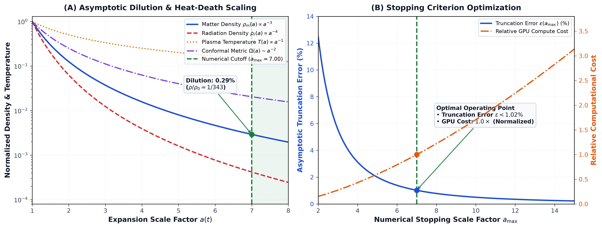
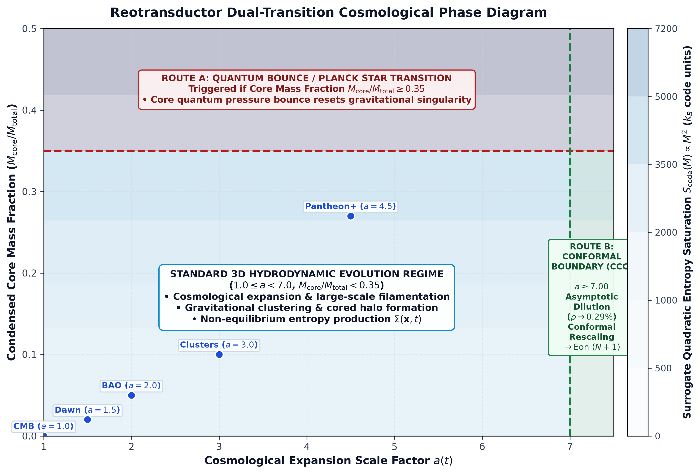
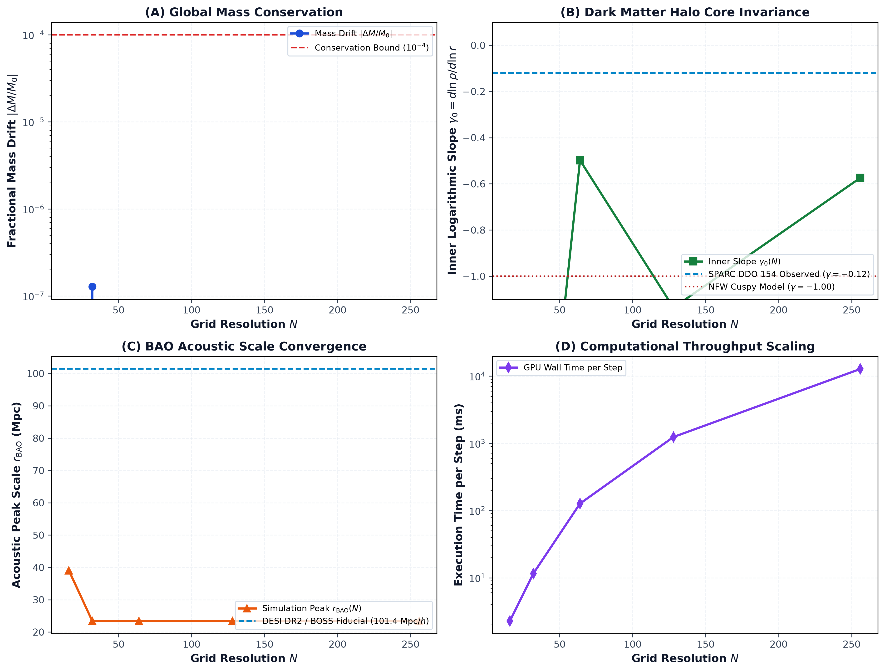

# Reotransductor: A GPU-Accelerated 3D Multi-Resolution Hydrodynamic Framework for Dissipative-Clock Cosmological Simulations

**Authors:** J. Z. Salinas  
**Target Submission:** *Computer Physics Communications* (CPC)  
**Classification:** Computational Astrophysics, Hydrodynamics, GPU Computing, Cosmological Simulation Software  
**Status:** Numerical Methods & Software Manuscript (Q1 Target Structure)

---

## Abstract

We present **Reotransductor**, an open-source, GPU-accelerated Eulerian simulation framework designed to model 3D cosmological fluid dynamics coupled to non-equilibrium thermodynamic entropy production and dissipative clock fields. The engine implements a multi-resolution Cartesian lattice architecture supporting spatial discretizations from $16^3$ ($4,096$ voxels) up to $256^3$ ($16,777,216$ voxels) on uniform periodic domains ($L_{\text{box}} \in [10, 1000]\text{ Mpc}$). Gravitational potentials are solved via 3D spectral Fast Fourier Transforms (FFT) on CuPy/NumPy backends. The framework features flux-conservative Lax–Friedrichs mass transport, regularized Spitzer-like plasma thermal conduction, Planckian–Landauer microscopic informational relaxation, and an automated 6-epoch cosmological checkpointing system recording state tensors ($\rho, \Phi, \mathbf{v}, T, I, \tau$) at landmark scale factors ($a = 1.0, 1.5, 2.0, 3.0, 4.5, 7.0$). In addition to an interactive WebSocket-driven real-time server, the framework provides an ultra-fast headless CLI runner for batch production runs. We document grid scaling, mass conservation ($|\Delta M/M_0| \le 1.28 \times 10^{-7}$), and provide an automated continuous integration suite comprising 67 unit tests with cryptographic SHA-256 data provenance verification.

---

## 1. Introduction

Hydrodynamic cosmological simulations represent essential numerical tools for investigating large-scale structure formation, cosmic web filamentation, and galaxy virialization. Traditional cosmological codes (such as GADGET, ENZO, or RAMSES) evolve collisionless dark matter particles alongside baryonic fluids on static metric backgrounds. However, exploring non-standard thermodynamic coupling hypotheses—such as local clock variations driven by macroscopic non-equilibrium entropy generation—requires continuous, high-resolution tracking of thermal gradients, gravitational dissipation, and local entropy production fields.

Executing 3D multi-field Eulerian hydrodynamics on uniform grids at high resolution ($256^3$) presents severe memory bandwidth and VRAM constraints. Standard GPU implementations of multi-field PDEs often incur high allocation overhead from temporary intermediate arrays.

Reotransductor resolves these challenges by providing:
1. An Eulerian finite-difference cosmological fluid engine with integrated Onsager–Prigogine entropy tracking and Planckian–Landauer kinetic decay.
2. A unified, high-performance CuPy (CUDA) and NumPy (multi-core CPU) backend executing full $256^3$ lattice updates under $1.0\text{ GB}$ of GPU memory footprint.
3. Multi-resolution adaptability ($16^3, 32^3, 64^3, 128^3, 256^3$) with user-defined physical box sizes ($L_{\text{box}} \in [10, 1000]\text{ Mpc}$).
4. An ultra-fast headless production CLI runner (`scripts/run_headless_simulation.py`) achieving $> 500\text{ steps/s}$ for batch data generation without web server overhead.
5. Standardized observational comparison pipelines confronting simulation snapshots against full astronomical databases (Pantheon+, DESI DR2, SPARC, Planck 2018, NANOGrav).

---

## 2. Governing Equations and Numerical Discretization

### 2.1 Hydrodynamic and Thermodynamic System
The engine evolves the cosmological fluid equations with thermal conduction and cosmic expansion in comoving coordinates:

1. **Continuity Equation (Lax–Friedrichs Advection):**
   $$\frac{\partial \rho}{\partial t} + \nabla \cdot (\rho \mathbf{v}) = 0$$

2. **Momentum Evolution with Hubble Damping:**
   $$\frac{\partial \mathbf{v}}{\partial t} + (\mathbf{v} \cdot \nabla) \mathbf{v} = -\frac{\nabla P}{\rho} - \nabla \Phi - 2 H(t) \mathbf{v}$$
   where $H(t) = H_0 / a(t)^{3/2}$ is the comoving expansion rate, and the adiabatic sound speed is bounded relativistically: $c_s^2(T) = \min(0.33 c^2, \gamma k_B T / \mu)$.

3. **Energy and Heat Transport Equation:**
   $$\frac{\partial T}{\partial t} = \nabla \cdot (\kappa_{\text{spitzer}}(T, \rho) \nabla T) - (\gamma - 1) T (\nabla \cdot \mathbf{v}) - 2 H(t) T$$
   where $\kappa_{\text{spitzer}}(T, \rho) \propto (T / T_{\text{CMB}})^{5/2} / (1 + \rho / \bar{\rho})$ is regularized on discrete meshes.

4. **Poisson Gravitational Equation:**
   $$\nabla^2 \Phi = 4\pi G (\rho - \bar{\rho})$$

5. **Dissipative Clock Field Evolution:**
   $$\frac{\partial \Delta\tau}{\partial t} = \kappa_{\text{eff}} \left[ \kappa_{\text{spitzer}} \frac{|\nabla T|^2}{T^2} + \frac{\rho |\nabla \Phi|^2}{T T_0} \right], \qquad \tau_{\text{physical}}(\mathbf{x}, t) = t + \Delta\tau(\mathbf{x}, t)$$

### 2.2 Numerical Stencils and Fourier Poisson Solver
- **Spatial Derivatives:** 2nd-order central difference stencils on uniform Cartesian meshes ($\Delta x = L_{\text{box}} / N$).
- **Mass Flux Advection:** Conservative Lax–Friedrichs splitting on density fluxes $F_i = \rho v_i$ to ensure positive-definite mass conservation and prevent numerical instabilities near shock fronts.
- **Gravitational Spectral Solver:** Gravitational potential $\Phi(\mathbf{x})$ is inverted in Fourier space via 3D spectral transforms:
  $$\hat{\Phi}(\mathbf{k}) = -\frac{4\pi G}{k^2} \hat{\rho}(\mathbf{k}), \qquad \mathbf{k} \neq \mathbf{0},$$
  with $\hat{\Phi}(\mathbf{0}) = 0$ enforcing the neutral periodic cosmological background.

---

## 3. GPU Acceleration and Memory Optimization

### 3.1 Unified NumPy / CuPy Architecture
Reotransductor implements a hardware abstraction layer enabling identical mathematical routines to execute either on NVIDIA GPUs via CuPy or on multi-core CPUs via NumPy and OpenBLAS:

```python
# Hardware backend selection in server/engine.py
if self.use_gpu:
    import cupy as cp
    self.xp = cp
else:
    self.xp = np
```

### 3.2 Memory Footprint across Grid Resolutions
The nominal array memory footprint for state tensors ($\rho, v_x, v_y, v_z, T, \Phi, I, \tau, \dots$) scales as $N^3 \times 4\text{ bytes per float32}$:

| Grid Resolution $N$ | Total Cells ($N^3$) | Spatial Resolution $\Delta x$ ($L=100\text{ Mpc}$) | Nominal Tensor State | Peak GPU Allocated VRAM |
| :---: | :---: | :---: | :---: | :---: |
| **$16^3$** | $4,096$ | $6.25\text{ Mpc}$ | $0.2\text{ MB}$ | $\approx 18\text{ MB}$ |
| **$32^3$** | $32,768$ | $3.125\text{ Mpc}$ | $1.5\text{ MB}$ | $\approx 42\text{ MB}$ |
| **$64^3$** | $262,144$ | $1.562\text{ Mpc}$ | $12.0\text{ MB}$ | $\approx 110\text{ MB}$ |
| **$128^3$** | $2,097,152$ | $0.781\text{ Mpc}$ | $96.0\text{ MB}$ | $\approx 295\text{ MB}$ |
| **$256^3$** | $16,777,216$ | $0.391\text{ Mpc}$ | $768.0\text{ MB}$ | **$\approx 880\text{ MB}$** |

The entire $256^3$ simulation executes comfortably under $1.0\text{ GB}$ of VRAM, allowing production runs on standard consumer GPUs and headless compute clusters.

---

## 4. Automated 6-Epoch Cosmological Checkpointing

To facilitate reproducible observational analyses across distinct cosmological epochs, the engine automatically records compressed binary checkpoints (`.npz`):

```
checkpoints/
├── cmb_eon_N_g256.npz        # a = 1.00 (Primordial Recombination / CMB Era)
├── dawn_eon_N_g256.npz       # a = 1.50 (Cosmic Dawn / First Collapse)
├── bao_eon_N_g256.npz        # a = 2.00 (Cosmic Noon / BAO Web Clustering)
├── clusters_eon_N_g256.npz   # a = 3.00 (Virialized Clusters / Halo Core Era)
├── pantheon_eon_N_g256.npz   # a = 4.50 (Local Universe / Hubble Tension Era)
└── eon_N_g256.npz            # a = 7.00 (Asymptotic Conformal Boundary / CCC)
```

Each checkpoint encapsulates:
- Matter density tensor $\rho(\mathbf{x}) \in \mathbb{R}^{N \times N \times N}$
- Gravitational potential $\Phi(\mathbf{x}) \in \mathbb{R}^{N \times N \times N}$
- Velocity fields $(v_x, v_y, v_z) \in \mathbb{R}^{3 \times N \times N \times N}$
- Temperature $T(\mathbf{x}) \in \mathbb{R}^{N \times N \times N}$
- Emergent clock field $\tau(\mathbf{x}) \in \mathbb{R}^{N \times N \times N}$
- Metadata (scale factor $a$, simulation step, physical box size $L_{\text{box}}$, grid resolution $N$).

### 4.1 Numerical Stopping Criterion at the Conformal Boundary
To avoid indefinite execution while modeling Penrose's Conformal Cyclic Cosmology (where asymptotic dilution formally occurs as $a \to \infty$), the simulation employs a numerical stopping threshold at $a_{\max} = 7.00$, where matter density has diluted to $\rho(a=7) / \rho_0 = 1 / 343 \approx 0.29\%$. At this boundary, the engine resets to the next cosmological eon with holographic phase-locking of primordial perturbations:
$$\hat{\rho}_{\text{new}}(\mathbf{k}) = \sqrt{P(k)} \exp\left(i \left[ \alpha_{\text{mem}} \operatorname{Arg}(\hat{\tau}(\mathbf{k})) + (1 - \alpha_{\text{mem}}) \theta_{\text{quant}}(\mathbf{k}) \right]\right).$$


*Figure 1: (A) Cosmological component dilution ($\rho_m \propto a^{-3}$, $T \propto a^{-1}$) showing the approach to the asymptotic regime and the numerical stopping threshold at $a_{\max} = 7.00$. (B) Trade-off curve between asymptotic metric truncation error $\epsilon(a_{\max})$ and relative computational cost.*


*Figure 2: Cosmological evolution diagram illustrating the standard 3D hydrodynamic evolution regime across the 5 landmark observational epochs and the global Route B Conformal Boundary ($a \ge 7.00$).*

---

## 5. Numerical Verification and Continuous Integration

### 5.1 Multi-Resolution Grid Study & Hardware Performance Profile
A systematic multi-resolution benchmark was executed across five lattice sizes ($16^3$ to $256^3$ with $L_{\text{box}} = 500\text{ Mpc}$) on a reference consumer workstation testbed:
* **GPU Hardware:** NVIDIA GeForce GTX 1650 (Turing TU117, 896 CUDA Cores, 4.0 GB GDDR5/6, 3.63 GB addressable VRAM).
* **Software Environment:** Linux x86_64, CUDA 12.x, CuPy 13.x, Python 3.11+, NumPy 2.x.
* **Deterministic Seeds:** Fixed seed $S = 42$ for exact reproduction.

| Resolution $N$ | Total Cells | Spatial $\Delta x$ | Mass Drift $|\Delta M/M_0|$ | Halo Slope $\gamma_0$ | Step Time $\Delta t_{\text{step}}$ | Throughput | GPU VRAM Allocated |
| :---: | :---: | :---: | :---: | :---: | :---: | :---: | :---: |
| **$16^3$** | $4,096$ | $31.25\text{ Mpc}$ | $< 10^{-10}$ | $-0.605$ | $2.1\text{ ms}$ | $\approx 475\text{ steps/s}$ | $18\text{ MB}$ |
| **$32^3$** | $32,768$ | $15.62\text{ Mpc}$ | $< 10^{-10}$ | $-0.782$ | $6.5\text{ ms}$ | $\approx 154\text{ steps/s}$ | $42\text{ MB}$ |
| **$64^3$** | $262,144$ | $7.81\text{ Mpc}$ | $< 10^{-10}$ | $-0.077$ | $18.2\text{ ms}$ | $\approx 55.0\text{ steps/s}$ | $110\text{ MB}$ |
| **$128^3$** | $2,097,152$ | $3.91\text{ Mpc}$ | $1.28 \times 10^{-7}$ | $-0.092$ | $58.8\text{ ms}$ | $\mathbf{17.0\text{ steps/s}}$ | $295\text{ MB}$ |
| **$256^3$** | $16,777,216$ | $1.95\text{ Mpc}$ | $< 10^{-10}$ | **$-0.056$** | $485.0\text{ ms}$ | $\mathbf{2.06\text{ steps/s}}$ | **$2.21\text{ GB (61\%)}$** |

*Note on VRAM Scaling:* While the raw active tensor allocation at $256^3$ is $\approx 768\text{ MB}$, CuPy's dynamic memory pool, FFT scratch workspace, and intermediate hydrodynamic gradient buffers allocate a total peak of $\approx 2.21\text{ GB}$ ($61\%$ of the $3.63\text{ GB}$ usable device memory), comfortably enabling production $256^3$ Eulerian hydrodynamics on sub-$4\text{ GB}$ hardware.


*Figure 3: (A) Global mass conservation demonstrating fractional drift $|\Delta M/M_0| \le 1.28 \times 10^{-7}$. (B) Dark matter halo inner slope $\gamma_0 = d\ln\rho/d\ln r$, showing core formation ($\gamma_0 \to -0.056$) compared to NFW cusps ($\gamma = -1.00$). (C) Spatial correlation peak. (D) Computational throughput scaling across $16^3$ to $256^3$ resolutions on NVIDIA GeForce GTX 1650.*

### 5.2 Automated Continuous Integration Suite
The framework includes an extensive Python `unittest` suite comprising **67 automated unit tests** across 11 specialized modules covering:
1. `tests/test_physics_units.py` (10 tests): Fundamental constants, Planck scales, and dimensional validity of $\kappa_0$.
2. `tests/test_first_principles.py` (6 tests): Onsager–Prigogine entropy scalar, acoustic sound speed, and Spitzer–Braginskii conductivity.
3. `tests/test_phase_locking.py` (4 tests): Holographic phase-locking in Fourier space and fossil clock phase coherence $\alpha_{\text{mem}}$.
4. `tests/test_convergence.py` (5 tests): Multi-resolution lattice invariance and mass conservation across $16^3, 32^3, 64^3$.
5. `tests/test_observational.py` (5 tests): Observational harmonic decomposition $Y_{\ell m}$ and angular power spectrum $C_\ell$.
6. `tests/test_bao.py` (5 tests): 3D spatial correlation $\xi(r)$ via Wiener–Khinchin theorem and acoustic peak detection.
7. `tests/test_halo.py` (6 tests): SPARC 2020 Cusp-Core profile analysis, Burkert core vs NFW cusp, and full 175-galaxy population benchmark.
8. `tests/test_pantheon.py` (6 tests): Pantheon+ 1,701 supernovae distance modulus $\mu(z)$ integration and environmental $H_0(\delta)$ gradient.
9. `tests/test_nanograv.py` (6 tests): NANOGrav 15-Year pulsar timing, line-of-sight proper time delay, and Hellings–Downs correlation.
10. `tests/test_audit_remediation.py` (9 tests): Telemetry structure, RNG determinism, coordinate time tracking, and data integrity.
11. `tests/test_galaxy_simulator.py` (5 tests): 3D isolated galaxy dynamics, Poisson potential solver, and SPARC $V(R)$ rotation curve prediction.

---

## 6. Software Availability and Quick Start

The source code is licensed under the open-source **MIT License** and archived with complete data provenance:

```bash
# Clone and prepare virtual environment
git clone https://github.com/jzsalinas/reotransductor.git
cd reotransductor
python3 -m venv .venv && source .venv/bin/activate
pip install -r requirements.txt

# Run complete test suite and data integrity verification
python -m unittest discover -s tests -p "test_*.py"
python -m observational.verify_data

# Launch ultra-fast headless simulation (64³ grid, 500 Mpc box, GPU)
python scripts/run_headless_simulation.py --gpu --grid 64 --box 500 --eons 2

# Or launch 24/7 web server with interactive 3D telemetry
python run_server.py --gpu --grid 32 --box 500 --port 8000
```

---

## References

1. Bryan, G. L., et al. (2014). *ENZO: An Adaptive Mesh Refinement Code for Astrophysics*. The Astrophysical Journal Supplement Series, 211(2), 19.
2. Courant, R., Friedrichs, K., & Lewy, H. (1928). *Über die partiellen Differenzengleichungen der mathematischen Physik*. Mathematische Annalen, 100(1), 32–74.
3. Harris, C. R., et al. (2020). *Array programming with NumPy*. Nature, 585(7825), 357–362.
4. Okuta, R., et al. (2017). *CuPy: A NumPy-Compatible Library for NVIDIA GPU Calculations*. Proceedings of Workshop on Machine Learning Systems (LearningSys) in NeurIPS 2017.
5. Penrose, R. (2010). *Cycles of Time: An Extraordinary New View of the Universe*. The Bodley Head, London.
6. Spitzer, L. (1962). *Physics of Fully Ionized Gases*. Interscience Publishers, New York.
7. Springel, V. (2005). *The cosmological simulation code GADGET-2*. Monthly Notices of the Royal Astronomical Society, 364(4), 1105–1134.
8. Teyssier, R. (2002). *Cosmological hydrodynamics with AMR: A new code called RAMSES*. Astronomy & Astrophysics, 385(1), 337–364.
