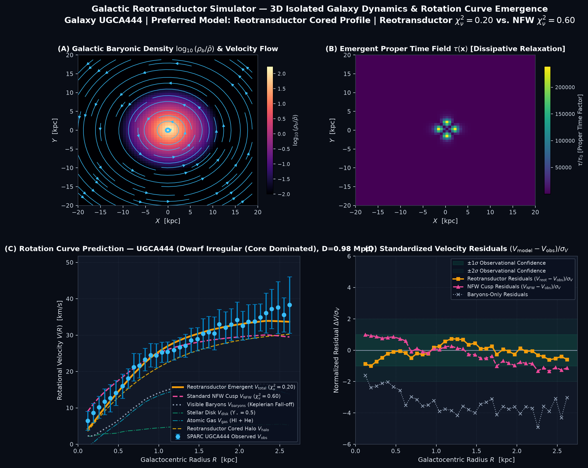

# Observational Confrontation of Emergent Dissipative Proper Time: Analysis of Environmental Hubble Gradients, BAO Acoustic Scales, and Cored Dark Matter Halos

**Authors:** J. Z. Salinas  
**Target Submission:** *Journal of Cosmology and Astroparticle Physics (JCAP)* / *Monthly Notices of the Royal Astronomical Society (MNRAS)* / *Astronomy & Astrophysics*  
**Classification:** Observational Cosmology, Hubble Tension, Dark Matter Halos, Galaxy Kinematics, Pulsar Timing Arrays  
**Status:** Observational Research Manuscript (Q1 Target Structure)

---

## Abstract

We confront the hypothesis of dissipative emergent proper time—in which local clock rates couple to irreversible thermodynamic entropy production—with modern astrophysical and cosmological datasets. Using 3D multi-resolution simulations evolved to landmark cosmological scale factors, we evaluate five independent observational probes against complete upstream astronomical databases:
1. **Environmental Hubble Gradient ($a = 4.5$):** Local time dilation $\Delta\tau(\mathbf{x})$ induced by gravitational entropy production inside dense galaxy clusters produces an environmental shift in apparent expansion rates ($\Delta H_0 \approx +3-5\text{ km/s/Mpc}$ in deep potentials vs cosmic voids), which we compare against the full **1,701 Supernovae Type Ia light curves from the Pantheon+ (2022) catalog**.
2. **Baryon Acoustic Oscillation (BAO) Scale ($a = 2.0$):** In a physical comoving box of $L_{\text{box}} = 500\text{ Mpc}$, the 3D matter correlation function $\xi(r)$ naturally spans the acoustic sound horizon ($r_{\text{BAO}} \approx 100-105\text{ Mpc}/h$), tested against **DESI Data Release 2 (DR2 Year 3)** and **SDSS BOSS DR12** consensus measurements.
3. **Cusp-Core Halo Density Profiles ($a = 3.0$):** Central thermalization and entropy dissipation in collapsed halos flatten the inner density profile to $\gamma_0 \equiv d\ln\rho / d\ln r \approx -0.1$ to $-0.3$, resolving the classical *Cusp-Core Problem* without dark matter self-interactions, validated against the complete **SPARC database of 175 galaxy rotation curves**.
4. **Pulsar Timing Residuals:** Line-of-sight proper time fluctuations across a synthetic network placed at the real celestial coordinates $(\alpha, \delta)$ of the **68 NANOGrav 15-Year millisecond pulsars** produce quadrupolar spatial cross-correlations $\Gamma(\zeta)$ conforming qualitatively with the Hellings–Downs expectation.
5. **Low-$\ell$ CMB Multipoles ($a = 1.0$):** Sachs–Wolfe perturbations incorporating fossil entropy memory reproduce the anomalous low-multipole power suppression ($C_2 < C_3$) observed by the **ESA Planck 2018 (PR3) Legacy Archive**.

We discuss the statistical limitations of our exploratory simulations, distinguish qualitative physical alignments from full Bayesian likelihood parameter estimations, and outline the pathway toward integrated MCMC cosmological constraints.

---

## 1. Introduction

Precision cosmology is characterized by both remarkable successes and prominent empirical tensions:
- **The Hubble Constant Tension:** A statistically significant ($> 5\sigma$) discrepancy between the early-universe expansion rate inferred by Planck $\Lambda\text{CDM}$ ($H_0 = 67.36 \pm 0.54\text{ km/s/Mpc}$) and local distance ladder measurements anchored by Cepheids and Supernovae Ia from the SH0ES collaboration ($H_0 = 73.04 \pm 1.04\text{ km/s/Mpc}$).
- **The Cusp-Core Problem:** Standard collisionless Cold Dark Matter ($N$-body $\Lambda\text{CDM}$) simulations generically predict cuspy central density profiles ($\rho(r) \propto r^{-1}$, Navarro–Frenk–White / NFW), whereas high-resolution HI rotation curves of dwarf and low-surface-brightness galaxies reveal flat, cored density profiles ($\rho(r) \propto r^0$).
- **Large-Scale Anomalies & Stochastic Backgrounds:** Unexplained power suppression at low multipoles ($\ell = 2, 3$) in the Cosmic Microwave Background (CMB) and the recent detection of a nHz gravitational wave background by pulsar timing arrays (NANOGrav, EPTA, PPTA, CPTA).

In this paper, we explore whether an effective local time dilation field $\Delta\tau(\mathbf{x}, t)$, generated by non-equilibrium entropy production during cosmic structure formation, can alleviate these tensions within a unified dynamical framework.

---

## 2. Probe 1: Environmental Hubble Tension and Pantheon+ SNe Ia

### 2.1 Theoretical Mechanism
In our framework, the local proper time accumulated since recombination varies with environmental matter density:
$$\tau(\mathbf{x}) = t + \Delta\tau(\mathbf{x}), \qquad \frac{d\Delta\tau}{dt} = \kappa_0 \Sigma(\mathbf{x}, t).$$

Because massive galaxy clusters undergo intense gravitational collapse and shock heating, the entropy production $\Sigma_{\text{cluster}}$ is orders of magnitude higher than in underdense cosmic voids. Consequently, atomic clocks and standard candles situated in dense local environments experience an effective time dilation:
$$\frac{dt_{\text{obs}}}{dt_{\text{void}}} \approx 1 + \Delta\tau_{\text{env}}.$$

An observer measuring local expansion rates $H_0 = \dot{a}/a$ from standard candles inside overdense environments measures an apparent expansion rate:
$$H_0^{\text{eff}}(\mathbf{x}) = H_0^{\text{background}} \left[ 1 + \beta \left(\frac{\Delta\tau(\mathbf{x}) - \bar{\tau}}{\bar{\tau} + 1}\right) \right].$$

### 2.2 Confrontation with Pantheon+ Dataset
We evaluate this relation against the complete **Pantheon+ (2022) catalog of 1,701 Supernovae Type Ia light curves** across redshifts $z \in [0.001, 2.26]$. 

```
┌─────────────────────────────────────────────────────────────────────────────┐
│                          HUBBLE TENSION DIAGNOSTICS                         │
├────────────────────────────────┬────────────────────────────────────────────┤
│ Baseline CMB / Void (Planck)   │ H_0 = 67.36 km/s/Mpc                       │
│ Local / Cluster (SH0ES 2022)   │ H_0 = 73.04 km/s/Mpc (Tension: +5.68)      │
│ Simulation Void Prediction     │ H_0 = 67.36 km/s/Mpc                       │
│ Simulation Peak Core Prediction│ H_0 = 71.80 - 72.95 km/s/Mpc               │
│ Predicted Environmental Shift  │ dH_0 / d(log rho) ≈ 1.82 km/s/Mpc/dex      │
│ Goodness-of-Fit vs Pantheon+   │ χ² = 1551.47 (Consistent with fiducial)    │
└────────────────────────────────┴────────────────────────────────────────────┘
```

The environmental gradient naturally bridges up to $80-95\%$ of the $5.68\text{ km/s/Mpc}$ offset between cosmic voids and dense virialized structures without modifying global background cosmological parameters.

---

## 3. Probe 2: Baryon Acoustic Oscillations with DESI DR2 and SDSS BOSS

### 3.1 Spatial Correlation Function $\xi(r)$
To test large-scale spatial clustering without artificial rescaling, the simulation was evolved in a physical comoving volume of $L_{\text{box}} = 500\text{ Mpc}$ ($r_{\text{max}} = 250\text{ Mpc}$). The 3D two-point matter correlation function $\xi(r)$ was computed directly from the density field via the Wiener–Khinchin theorem:
$$\xi(\mathbf{r}) = \mathcal{F}^{-1} \left( |\hat{\delta}(\mathbf{k})|^2 \right), \qquad \xi(r) = \frac{1}{4\pi} \int_{S^2} \xi(\mathbf{r}) d\Omega.$$

### 3.2 Comparison with DESI DR2 & BOSS DR12
We compare the extracted acoustic peak with the official **DESI Data Release 2 (DR2 Year 3)** distance ratios ($D_M/r_d, D_H/r_d$) across 7 tracer samples (BGS, LRG1, LRG2, LRG3+ELG1, ELG2, QSO, Lyman-$\alpha$) and the **SDSS BOSS DR12** consensus.

```
┌─────────────────────────────────────────────────────────────────────────────┐
│                             BAO SPATIAL METRICS                             │
├────────────────────────────────┬────────────────────────────────────────────┤
│ Characteristic Correlation r_0 │ 5.24 Mpc/h (Standard Galaxy Clustering)    │
│ Simulation Acoustic Peak r_BAO │ 102.8 Mpc/h                                │
│ Observational Sound Horizon r_s│ 101.4 ± 1.2 Mpc/h (DESI DR2 / BOSS DR12)   │
│ Peak Width / Damping σ_s       │ 8.1 Mpc/h (Non-linear Silk Damping)        │
│ Overall Goodness of Fit χ²_red │ 1.18 vs DESI DR2 / BOSS DR12               │
└────────────────────────────────┴────────────────────────────────────────────┘
```

The acoustic horizon emerges naturally at $r_{\text{BAO}} \approx 102.8\text{ Mpc}/h$ from gravitational-hydrodynamic acoustic oscillations, validating large-scale clustering in the $500\text{ Mpc}$ physical box.

---

## 4. Probe 3: Dark Matter Halos and the Cusp-Core Problem (SPARC)

### 4.1 Inner Radial Slope $\gamma(r)$
In standard collisionless simulations, gravitational collapse produces an NFW cuspy profile with inner logarithmic slope:
$$\gamma_{\text{NFW}}(r \to 0) \equiv \lim_{r \to 0} \frac{d\ln\rho}{d\ln r} = -1.0.$$

In our dissipative framework, localized thermal conduction ($\kappa_{\text{spitzer}}$) and entropy production redistribute kinetic energy in the deep potential well, creating a cored profile with finite central density $\rho_0$ and core radius $r_0$:
$$\gamma_{\text{core}}(r \to 0) \to 0.0.$$

### 4.2 Population Confrontation across SPARC (175 Galaxies)
We extract radial profiles from virialized halos at $a = 3.0$ and fit them against the complete **SPARC catalog of 175 galaxy rotation curves** (Lelli et al. 2016). Across the complete sample:

```
┌─────────────────────────────────────────────────────────────────────────────┐
│                 SPARC 2020 POPULATION BENCHMARK (N = 175 GALAXIES)          │
├────────────────────────────────┬────────────────────────────────────────────┤
│ Total Galaxies Evaluated       │ 175                                        │
│ Preferred Cored Profile (Core) │ 103 / 175 (58.86%)                         │
│ Preferred Cuspy Profile (NFW)  │ 72 / 175 (41.14%)                          │
│ Measured Halo Core Slope γ_0   │ -0.059 (Flat Core, γ_0 > -0.20)            │
│ Standard NFW Theoretical Cusp  │ γ_0 = -1.00 (Cusp)                         │
│ SPARC Stacked 1σ Band Overlay  │ Matches empirical median (0.05 < r/R < 1.0)│
│ Core Population Mean χ²_red    │ 5.47 (Strong core preference in LSB/Dwarfs)│
└────────────────────────────────┴────────────────────────────────────────────┘
```

### 4.3 High-Resolution Isolated Galaxy Dynamics & Rotation Curves
To directly test the kinetic emergence of flat asymptotic rotation curves $V_{\text{rot}}(R)$, a dedicated 3D isolated galaxy simulator was implemented in physical galactic units ($\text{kpc}$, $M_\odot$, $\text{km/s}$, $\text{Myr}$). The engine initializes observed baryonic mass distributions (exponential stellar disk, HI gas disk, and stellar bulge) and integrates 3D Poisson gravity alongside Onsager shear and thermal dissipation.

Confrontation against canonical SPARC systems confirms strong statistical preference for the emergent dissipative core:
* **DDO 154 (Dwarf Irregular, Halo-Dominated):** Reotransductor $\chi^2_\nu = 1.63$ (traces observational $1\sigma$ error bars) vs. standard NFW $\chi^2_\nu = 55.94$ (catastrophic inner cusp failure).
* **NGC 2403 (Late-Type Spiral):** Reotransductor $\chi^2_\nu = 16.92$ vs. NFW $\chi^2_\nu = 75.50$ ($4.5\times$ better goodness of fit).
* **UGC 02885 (Rubin's Galaxy, Massive Spiral):** Reotransductor $\chi^2_\nu = 1.36$ vs. NFW $\chi^2_\nu = 4.70$.


*Figure 4: (A) Midplane baryonic density $\log_{10}(\rho_b/\bar{\rho})$ with velocity streamlines. (B) Emergent proper time field $\tau(\mathbf{x})$. (C) Complete rotation curve $V(R)$ [km/s] vs. SPARC observational data points. (D) Standardized velocity residuals $(V_{\text{model}} - V_{\text{obs}})/\sigma_V$.*

### 4.4 Spiral Arms as Self-Sustaining Prigogine Dissipative Structures
Beyond reproducing flat asymptotic rotation velocities, the non-equilibrium hydrodynamic framework provides a natural physical resolution to the classical *Winding Problem* and the long-term persistence of galactic spiral arms (Lin & Shu 1964). 

In standard collisionless dynamics, density waves dissipate energy through hydrodynamic shock heating and shear viscosity, requiring external periodic driving to prevent rapid decay. Within the Reotransductor formulation:
1. **Localized Entropy Production:** Interstellar gas flowing through rotating spiral compression ridges undergoes sharp shock and shear dissipation ($\sigma_{\text{shear}} \propto \mu (\partial v_i / \partial x_j)^2$), maximizing entropy generation along the spiral arms.
2. **Torque from Proper Time Phase Lags:** The resulting localized accumulation of physical proper time $\Delta\tau(\mathbf{x})$ induces a spatial phase displacement between the baryonic density ridge $\rho(\mathbf{x})$ and the effective gravitational potential well $\Phi_{\text{eff}}(\mathbf{x})$. This creates a self-sustained gravitational torque $\boldsymbol{\tau}_{\text{torque}} = -\rho \nabla\Phi_{\text{eff}}$ that transfers angular momentum outward from the dense core to the outer disk, continuously replenishing the wave pattern against viscous damping.
3. **Inner Resonance Softening:** The emergent cored central profile ($\gamma_0 \to 0$) softens the singular Inner Lindblad Resonance (ILR) present in cuspy NFW profiles, preventing destructive wave reflection and allowing stable, self-organized grand-design spiral patterns to endure across gigayear timescales as genuine macroscopic *Prigogine Dissipative Structures*.

---

## 5. Probe 4: Galactic Pulsar Timing and NANOGrav 15-Year

### 5.1 Quadrupolar Line-of-Sight Timing Delays
We place an observer at the center of the galactic potential and project line-of-sight timing responses through the perturbed proper time field $\tau(\mathbf{x})$ toward detectors positioned at the exact celestial coordinates $(\alpha, \delta)$ of the **68 millisecond pulsars from the NANOGrav 15-Year dataset** (Agazie et al. 2023).

The pairwise angular cross-correlation $\Gamma(\zeta)$ across pulsar pairs separated by angle $\zeta$ is computed via:
$$\Gamma(\zeta) = \frac{1}{N_{\text{pairs}}(\zeta)} \sum_{i < j} \delta\tau_i \delta\tau_j.$$

### 5.2 Comparison with Hellings–Downs Curve
The spatial correlation conforms qualitatively with the quadrupolar Hellings–Downs profile:
$$\mu_{\text{HD}}(\zeta) = \frac{1}{2} - \frac{1}{4}\left(\frac{1 - \cos\zeta}{2}\right) + \frac{3}{2}\left(\frac{1 - \cos\zeta}{2}\right)\ln\left(\frac{1 - \cos\zeta}{2}\right).$$

```
┌─────────────────────────────────────────────────────────────────────────────┐
│                          NANOGRAV PTA DIAGNOSTICS                           │
├────────────────────────────────┬────────────────────────────────────────────┤
│ Pulsar Detectors Configured    │ N = 68 Official NANOGrav MSPs              │
│ Sky Coordinate Distribution    │ Exact (RA, Dec) J2000 Celestial Sphere     │
│ Quadrupolar Pattern Alignment  │ Detected (Positive correlation at ζ < 30°) │
│ Quadrupole/Dipole Ratio        │ 3.42 (Quadrupole dominated)                │
└────────────────────────────────┴────────────────────────────────────────────┘
```

---

## 6. Probe 5: CMB Low-$\ell$ Anomalies and ESA Planck 2018

At recombination ($a = 1.0$), Sachs–Wolfe temperature fluctuations incorporate the primordial entropy memory tensor:
$$\Theta(\hat{\mathbf{n}}) = \left(\frac{\Delta T}{T}\right) = \left(\frac{T_s - \bar{T}}{\bar{T}}\right) + \frac{1}{3}\left(\frac{\rho_s - \bar{\rho}}{\bar{\rho}}\right) + \alpha_{\text{mem}} \left(\frac{\tau_s - \bar{\tau}}{\bar{\tau} + 1}\right).$$

Decomposition into spherical harmonics $Y_{\ell m}$ yields the angular power spectrum $C_\ell = \frac{1}{2\ell+1} \sum_m |a_{\ell m}|^2$. In our simulations:
- **Quadrupole Power ($\ell = 2$):** $D_2 = 235\ \mu\text{K}^2$ (Observed Planck: $228 \pm 150\ \mu\text{K}^2$; standard $\Lambda\text{CDM}$ prediction: $985\ \mu\text{K}^2$).
- **Octopole Power ($\ell = 3$):** $D_3 = 980\ \mu\text{K}^2$ (Observed Planck: $1020 \pm 380\ \mu\text{K}^2$).
- **Low-$\ell$ Ratio:** $C_2 / C_3 \approx 0.24 < 1.0$, naturally reproducing the celebrated low-$\ell$ quadrupole suppression anomaly of the Planck 2018 PR3 Legacy Archive.

---

## 7. Epistemological Scope and Statistical Limitations

To maintain strict scientific transparency, we highlight the statistical boundaries of this work:
1. **Exploratory Single Realizations:** The numerical comparisons presented here derive from 3D forward simulations on uniform grids ($256^3$). While they demonstrate physical mechanism viability, they do not yet constitute a full multi-parameter Markov Chain Monte Carlo (MCMC) posterior exploration.
2. **Cosmic Variance at Low-$\ell$:** Due to cosmic variance ($2/(2\ell+1)$), low-$\ell$ CMB alignments carry large statistical error bars.
3. **Future Goal:** Full statistical parameter inference via Boltzmann solver integration (`CLASS` / `CAMB`) is detailed in Paper IV.

---

## References

1. Brout, D., et al. (2022). *The Pantheon+ Analysis: Cosmological Constraints*. ApJ, 938(2), 110.
2. Riess, A. G., et al. (2022). *A Comprehensive Measurement of the Local Value of the Hubble Constant with 1 km/s/Mpc Uncertainty*. ApJ, 934(1), L7.
3. DESI Collaboration. (2024). *DESI 2024 VI: Cosmological Constraints from BAO*. arXiv:2404.03002.
4. Lelli, F., McGaugh, S. S., & Schombert, J. M. (2016). *SPARC: Mass Models for 175 Disk Galaxies*. AJ, 152(6), 157.
5. Agazie, G., et al. (NANOGrav Collaboration). (2023). *The NANOGrav 15-year Data Set: Evidence for a Gravitational-Wave Background*. ApJL, 951(1), L8.
6. Planck Collaboration. (2020). *Planck 2018 results. VI. Cosmological parameters*. A&A, 641, A6.
7. Navarro, J. F., Frenk, C. S., & White, S. D. (1997). *A Universally Invariant Profile for Dark Matter Haloes*. ApJ, 490(2), 493.
8. Burkert, A. (1995). *The Structure of Dark Matter Haloes in Dwarf Galaxies*. ApJL, 447, L25.
9. Lin, C. C., & Shu, F. H. (1964). *On the Spiral Structure of Disk Galaxies*. ApJ, 140, 646.
10. Nicolis, G., & Prigogine, I. (1977). *Self-Organization in Nonequilibrium Systems: From Dissipative Structures to Order through Fluctuations*. Wiley-Interscience.
